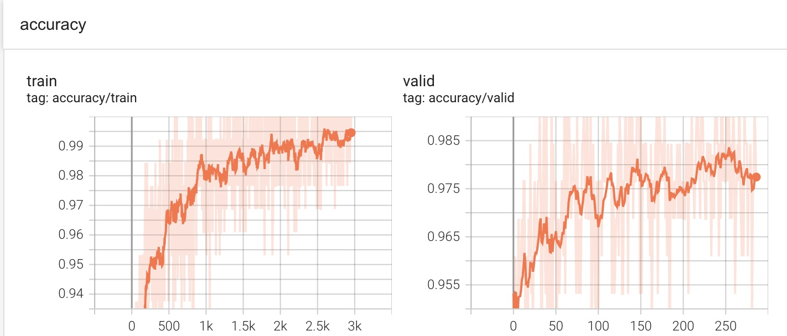
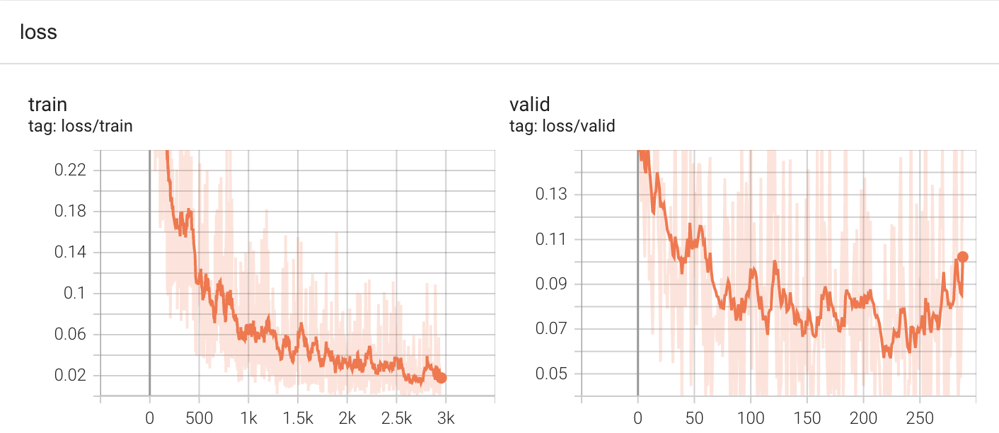
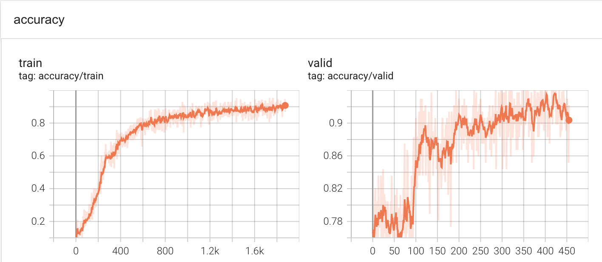
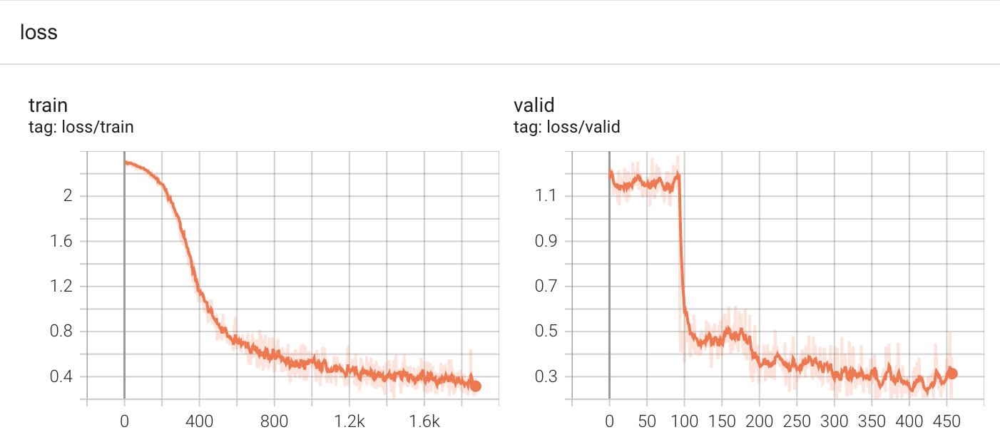
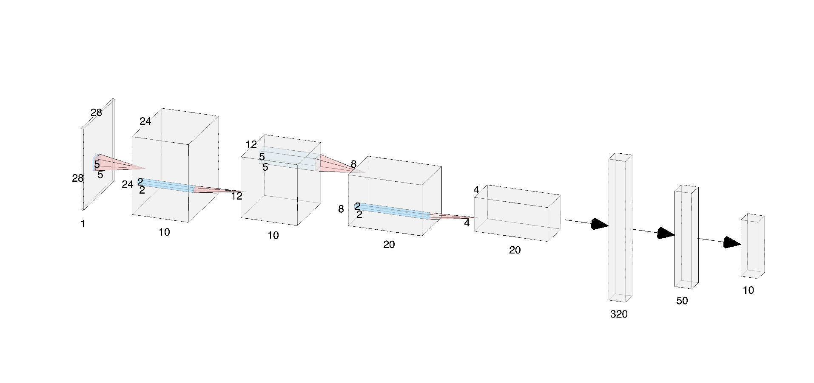

# AdML_A2
## 问题描述

• Task: handwritten digits recognition  (20 Points)

• Data: MNIST data set

• In this assignment you will practice training Neural Networks and Convolutional Networks. The goals of this assignment are as follows:

	– understand Neural Networks and how they are arranged in layered architectures
	
	– implement dropout to regularize networks and explore its effects on model generalization
	
	– effectively cross-validate and find the best hyperparameters for Neural Network architecture
	
	– understand the architecture of Convolutional Neural Networks and train gain experience with training these models on data


• Do something extra!

	– In the process of training your network, you should feel free to implement anything that you want to get better performance. You can modify the solver, implement additional layers, use different types of regularization, use an ensemble of models, or anything else that comes to mind.  (+5 points) 

## Requirements
- torch>=1.13 

- torchvision
- numpy
- tqdm
- tensorboard>=1.14
- pandas

## 一、Dropout

### 训练
修改`config.json`，将训练模型改为`DropoutModel`，运行命令：

```
python train.py --config config.json
```

### 测试

```
python test.py --config config.json --resume /path/to/checkpoint
```

### 结果对比
本实验采用的全连接神经网络进行训练，共设置五层神经元，每层神经元个数为[784, 500, 300, 100, 10]。采用小批量梯度下降法，SGD优化器，学习率调整机制为StepLR，共训练80个epoch。

在没有Dropout方法的情况下，训练结果如图所示：


<center style="font-size:14px;color:#C0C0C0;text-decoration:underline">图1.没有Dropout方法的accuracy</center> 


<center style="font-size:14px;color:#C0C0C0;text-decoration:underline">图2.没有Dropout方法的loss</center> 

可以看到，模型在$step=200$左右时开始过拟合。

在使用Dropout方法的情况下（在每个隐藏层之间均设置Dropout，`p=0.2`），训练结果如图所示：


<center style="font-size:14px;color:#C0C0C0;text-decoration:underline">图3.使用Dropout方法的accuracy</center>


<center style="font-size:14px;color:#C0C0C0;text-decoration:underline">图4.使用Dropout方法的loss</center>

可以发现，Dropout有效延缓了过拟合的出现。

|              | val acc | val loss | test acc | test loss |                    Model                     |
| :----------: | :-----: | :------: | :------: | :-------: | :------------------------------------------: |
| w.o. Dropout | 97.35%  |  0.084   |  97.3%   |   0.084   | [model](https://pan.quark.cn/s/2f5d90a4c56f) |
|   Dropout    | 97.49%  |  0.081   |  97.45%  |   0.082   | [model](https://pan.quark.cn/s/d191a1b543b7) |

## 二、交叉验证
本次实验使用5折交叉验证的方法，来寻找SGD的初始学习率参数lr，结果如下表：

|  lr   | val acc | test acc |
| :---: | :-----: | :------: |
| 0.001 | 93.06%  |  93.08%  |
| 0.005 | 97.49%  |  97.45%  |
| 0.01  | 98.06%  |  98.1%   |
| 0.05  | 98.54%  |  98.49%  |
|  0.1  | 98.67%  |  98.53%  |
|  0.2  | 98.53%  |  98.48%  |

由上表可知，$lr=0.1$更适合本任务。

## 二、CNN

### 训练
修改`config.json`，将训练模型改为`CNNModel`，运行命令：
```
python train.py --config config.json
```

### 测试

```
python test.py --config config.json --resume /path/to/checkpoint
```

### 网络架构
如下图所示：

<center style="font-size:14px;color:#C0C0C0;text-decoration:underline">图5.CNN网络架构图。分别在每次卷积操作后加入Relu激活函数；第二次卷积后加入了Dropout。</center> 

### 实验结果
实验采用小批量梯度下降法，SGD优化器（初始学习率为0.1，动量为0.5），学习率调整机制为StepLR（$step_size=30$,$gamma=0.1$)，共训练80个epoch。最终，验证集的精确度为99.06%，测试集精确度为99.12%，达到了很好的效果。